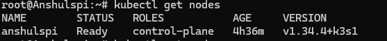
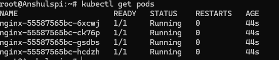
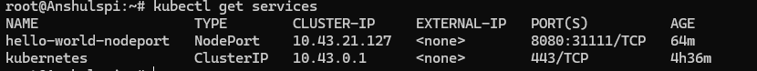
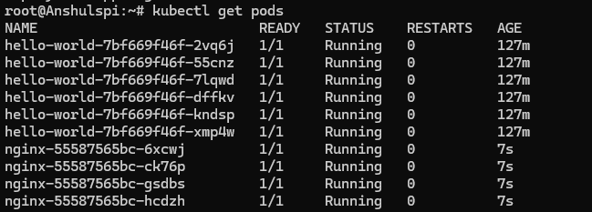

# ⚙️ K3s on Raspberry Pi 4 — Learning Kubernetes from Bare Metal

> This week I started building a bare-metal Kubernetes environment on a Raspberry Pi 4 to understand orchestration beyond managed cloud platforms. Instead of treating Kubernetes as a black box, I wanted to see what actually happens underneath.


---

## 📖 Table of Contents

- [Hardware](#hardware)
- [Foundation](#-foundation)
- [First Workload — Nginx](#-first-workload--nginx)
- [Service Exposure & Scaling](#-service-exposure--scaling)
- [Stress Testing](#-stress-testing)
- [kubectl Commands Reference](#-kubectl-commands-reference)
- [What I Learned](#-what-i-learned)
- [Next Steps](#-next-steps)

---

## Hardware

| Component | Details |
|-----------|---------|
| **Board** | Raspberry Pi 4 Model B |
| **RAM** | 8 GB |
| **Cluster** | Single-node (server + agent) |
| **Network** | Local network (`192.168.1.2`) |

---

## ⚙️ Foundation

I flashed **Raspberry Pi OS Lite**, configured networking, enabled cgroups, and installed **K3s** to run a lightweight control plane on the Pi.

```bash
# Install K3s
curl -sfL https://get.k3s.io | sh -

# Verify the cluster
sudo kubectl get nodes
```



---

## 📦 First Workload — Nginx

I deployed a multi-replica **Nginx** service and exposed it using NodePort to understand how traffic moves from outside the cluster into pods.

**[`firstapp.yaml`](firstapp.yaml)** — 4 replicas with a readiness probe:

```yaml
apiVersion: apps/v1
kind: Deployment
metadata:
  name: nginx
spec:
  replicas: 4
  ...
  containers:
    - name: nginx
      image: nginx:stable
      ports:
      - containerPort: 80
      readinessProbe:
        httpGet:
          port: web
          path: /
```

```bash
kubectl apply -f firstapp.yaml
kubectl get pods
kubectl get pods -l app=nginx   # Filter for just nginx pods
```



That led to my first big networking realization — **the IPs shown by Kubernetes are overlay network addresses that exist only inside the cluster.** To reach them from the outside, you need a Service.

**[`nginx-nodeport.yaml`](nginx-nodeport.yaml)** — Expose nginx on port `30080`:

```yaml
apiVersion: v1
kind: Service
metadata:
  name: nginx-nodeport
spec:
  type: NodePort
  selector:
    app: nginx
  ports:
    - port: 80
      targetPort: web
      nodePort: 30080
```

```bash
kubectl apply -f nginx-nodeport.yaml

# Access from any machine on the network:
curl http://192.168.1.2:30080
```

---

## 🌐 Service Exposure & Scaling

I then deployed a distributed demo application across **6 replicas** and exposed it via a **NodePort** service. Refreshing the endpoint showed requests being **load balanced across different pods** in real time.

**[`rancherdemo.yaml`](rancherdemo.yaml)** — Rancher demo app (each pod shows its hostname, so you can _see_ load balancing):

```yaml
apiVersion: apps/v1
kind: Deployment
metadata:
  name: hello-world
spec:
  replicas: 6
  ...
  containers:
    - name: hello-world
      image: bashofmann/rancher-demo:1.0.0
      ports:
      - containerPort: 8080
      env:
        - name: COW_COLOR
          value: purple
```

**[`nodeport.yaml`](nodeport.yaml)** — Expose it on port `31111`:

```yaml
apiVersion: v1
kind: Service
metadata:
  name: hello-world-nodeport
spec:
  type: NodePort
  selector:
    app: hello-world
  ports:
    - port: 8080
      targetPort: web
      nodePort: 31111
```

```bash
kubectl apply -f rancherdemo.yaml
kubectl apply -f nodeport.yaml

# Access from any machine on the network:
curl http://192.168.1.2:31111
```
!(assets/week1/rancher-demo.png)




---

## ⚡ Stress Testing

Using a concurrent Python client, I generated load against the cluster to observe **latency, dropped requests, and resource limits** on constrained hardware.

**[`multithread.py`](multithread.py)** — 5,000 requests with 20 concurrent workers:

```python
import requests
from concurrent.futures import ThreadPoolExecutor
import time

url = "http://192.168.1.2:30001"
TOTAL_REQUESTS = 5000
WORKERS = 20

def hit(i):
    try:
        r = requests.get(url, timeout=3)
        return r.status_code
    except Exception as e:
        return e

start = time.time()

with ThreadPoolExecutor(max_workers=WORKERS) as executor:
    results = list(executor.map(hit, range(TOTAL_REQUESTS)))

end = time.time()

success = results.count(200)

print(f"Success {success}/{TOTAL_REQUESTS}")
print(f"Time: {end - start:.2f}s")
```

### What the test measures:

| Metric | Description |
|--------|-------------|
| **Throughput** | Requests/sec the Pi can serve |
| **Success Rate** | % of requests returning HTTP 200 |
| **Latency** | Total time for 5,000 requests |
| **Stability** | Does the cluster drop requests under load? |

```bash
pip install requests
python multithread.py
```

> **Seeing failures under load wasn't a bug — it was capacity. That distinction changed how I think about systems.**

---

## 📋 kubectl Commands Reference

All the commands I used during Week 1, organized by category:

### Cluster & Node Management

| Command | Description |
|---------|-------------|
| `sudo kubectl get nodes` | List all nodes in the cluster |
| `kubectl cluster-info` | Show cluster endpoint details |

### Deployments

| Command | Description |
|---------|-------------|
| `kubectl apply -f <file>.yaml` | Create or update resources from a YAML file |
| `kubectl get deployments` | List all deployments |
| `kubectl delete deployment <name>` | Delete a deployment and its pods |

### Pods

| Command | Description |
|---------|-------------|
| `kubectl get pods` | List all pods in the default namespace |
| `kubectl get pods -l app=<label>` | Filter pods by label selector |
| `kubectl get pods -o wide` | List pods with extra details (IP, node, image) |
| `kubectl get pods --selector=app=<label>` | Alternative label filter syntax |

### Services & Networking

| Command | Description |
|---------|-------------|
| `kubectl get services` | List all services |
| `kubectl delete service <name>` | Delete a service |
| `curl http://<node-ip>:<nodePort>` | Access a NodePort service externally |

### Troubleshooting

| Command | Description |
|---------|-------------|
| `kubectl describe pod <pod-name>` | Detailed pod info and events |
| `kubectl logs <pod-name>` | View container logs |

---

## 🧠 What I Learned

1. **Overlay networks are invisible** — Kubernetes pod IPs exist only inside the cluster. Understanding this was the first real "aha" moment.
2. **Load balancing works out of the box** — Even on a single node, K8s distributes traffic across pods automatically.
3. **Readiness probes prevent bad traffic** — Without them, requests hit pods that aren't ready yet.
4. **NodePort is the simplest external access** — Perfect for local network testing and learning.
5. **Failures under load = capacity, not bugs** — The Pi has real hardware limits, and seeing them taught me more than any tutorial.
6. **K3s is the right tool for learning** — Lightweight enough for a Pi, but fully Kubernetes-compliant.
7. **Label selectors are essential** — Using `-l app=<name>` to filter pods by deployment is critical when running multiple workloads.

---

## 🚀 Next Steps

- [ ] Set up Traefik Ingress (built into K3s) for smarter routing
- [ ] Deploy a real app (REST API + database)
- [ ] Monitor with Prometheus + Grafana
- [ ] Experiment with pod autoscaling under load

---

## License

This project is for learning purposes. Feel free to use any of these configs for your own Kubernetes experiments!
